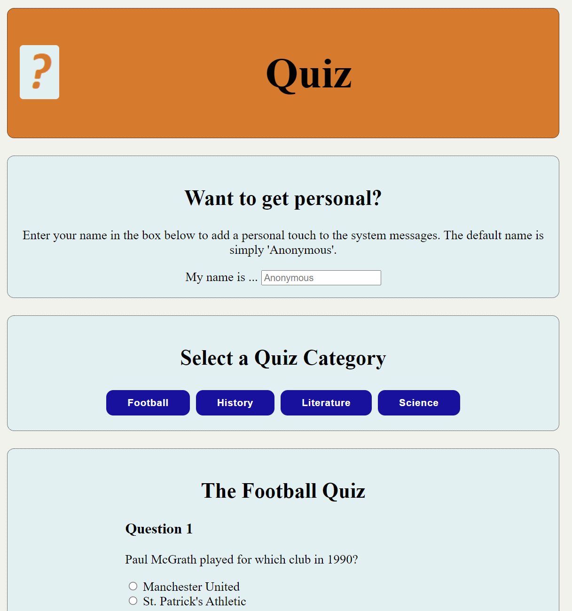
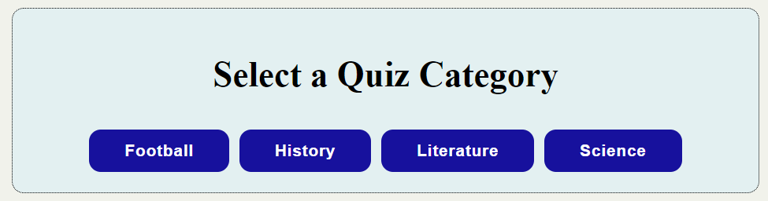
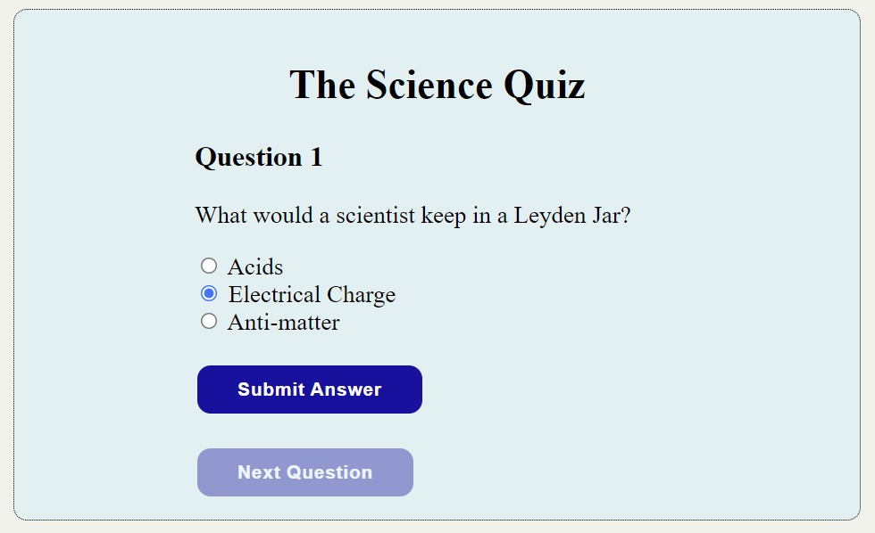
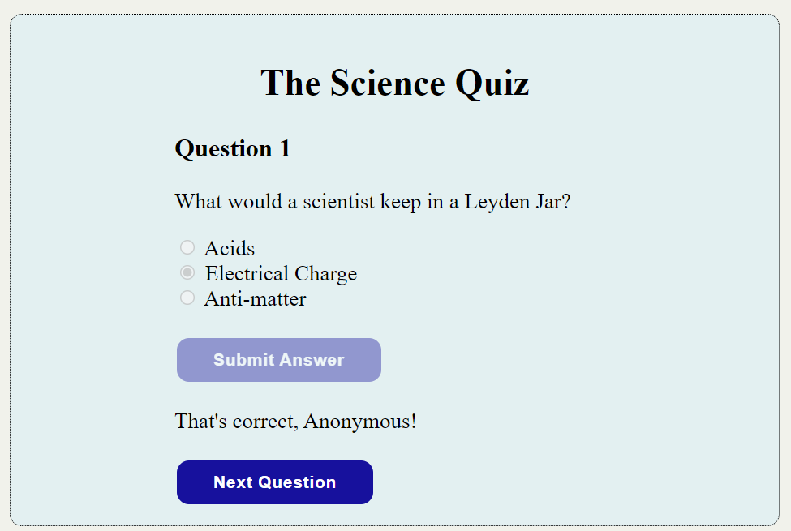
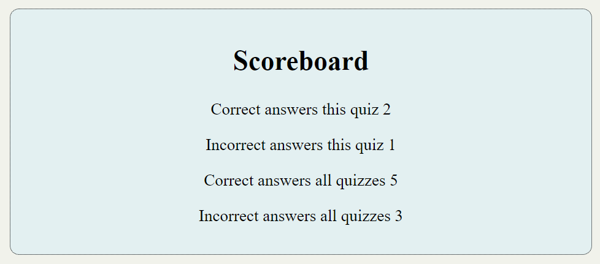
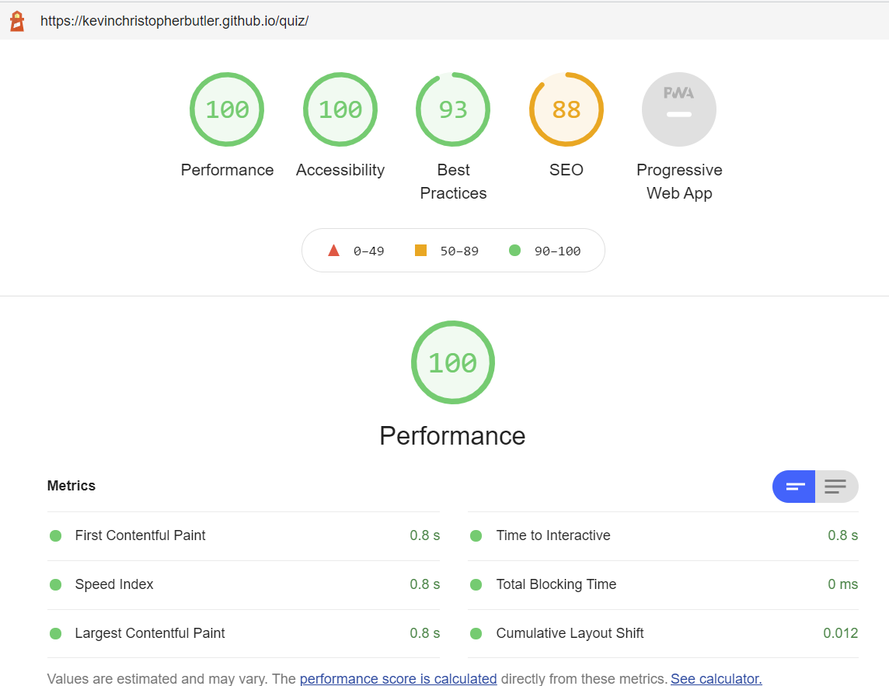

# Quiz Application

This is an interactive quiz application built on HTML/CSS and JavaScript. The site offers a choice of four quiz
categories. By default, the "football category" is displayed initially.

The application is aimed at the casual viewer, a means of passing some 'down time'. The multiple choice aspect
ensures that specialist knowledge is not required to complete any category.

## Features

- The site offers a choice of four quiz categories viz. Football, History, Literature and Science.
- There are five multiple-choice questions associated with each category.
- The application maintains a count of correct and incorrect responses per category, as well as the overall score over all categories.
- A user may also enter a name to add a personal note to the screen messages.
- The site is fully responsive.

## Testing

## Playing the Game

When the quiz application is first displayed, the football category is selected by default. The user may, at any point, select
a different category from the four-button menu area:

Each question is displayed with three possible answers. Below the question are two buttons which are disabled when the question is displayed. These buttons allow the user to submit an answer and display the next question at the appropriate times.

When the user clicks on a radio button (a possible answer), the 'Submit Answer' button is enabled.

Pressing the 'Submit Answer' button checks the submitted answer. An appropriate message is displayed for correct and incorrect answers. In either case, the 'Submit Answer' button is disabled while the 'Next Question' button is enabled.

By default, the messages displayed are impersonal, referring to the user simply as 'Anonymous'. The messages may be personalised by entering a name in the 'Want to get personal?' area.

The application tracks the score for the current quiz category and the overall score across all categories in the 'Scoreboard' area.

### Validator Testing

### HTML
The HTML check (https://validator.w3.org) shows three warning messages. Two of these are "empty heading" messages. This is acceptable as the headings in question are populated by the JavaScript processing. The third warning states that it is unnecessary to specify the file type when referencing the JavaScript script file itself. I prefer to include the file type in all cases. 

### CSS
No errors were found by the Jigsaw validator (https://jigsaw.w3.org/css-validator).

### Accessibility
Lighthouse showed an accessibility score of 100.

### Unfixed Bugs

None.

## Deployment

The site was deployed to GitHub pages. The steps to deploy are as follows:

- In the GitHub repository, navigate to the Settings tab
- Click on 'Pages' in the menu on the left.
- From the source section drop-down menu, select the Main Branch.
- Press the 'Save' button.
- Once the main branch has been selected, the page will be automatically refreshed with a detailed ribbon display to indicate the successful deployment.

The live link is: https://kevinchristopherbutler.github.io/quiz/

## Credits

The quiz questions were composed by the site author.

The favicon was generated using free software supplied by favicon.io (https://favicon.io/).

